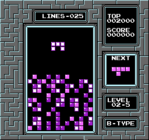

# Pentris

This is NES tetris with an extra mino added.  This game includes 18 shapes each consisting of 5 blocks that must be pieced together on a 14x22 playfield, with completed rows being cleared.  It's like Tetris but with more frustration. 




This is based off of CelestialAmber's Tetris [dissassembly](https://github.com/CelestialAmber/TetrisNESDisasm), which is based off of ejona86's [taus](https://github.com/ejona86/taus).  Ideas for handling nametables were borrowed from kirjavascript's [TetrisGYM](https://github.com/kirjavascript/TetrisGYM).


# Release

This is released as a BPS patch file that can be applied to the USA version of tetris.nes using [Rom Patcher JS](https://www.romhacking.net/patch/) or any patching tool.  

# Build

### Requirements

* Python 3 along with the Pillow library.
* make
* gcc

### Included requirements

* [cc65](https://github.com/cc65/cc65)
* [nes-util](https://github.com/qalle2/nes-util)
* [flips](https://github.com/Alcaro/Flips)

### Compile MMC1

```
make
```

### Compile CNROM

```
touch *.asm
make flags CNROM
```

### Create patch

Place a romfile named clean.nes with an md5sum of `ec58574d96bee8c8927884ae6e7a2508` in the project directory.

```
make patch
```