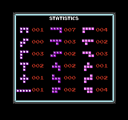

# Pentris

This is NES tetris with an extra mino added.  This game includes 18 shapes each consisting of 5 blocks that must be pieced together on a 14x22 playfield, with completed rows being cleared.  It's like Tetris but with more frustration.


# Release

This is released as a BPS patch file that can be applied to the USA version of tetris.nes using [Rom Patcher JS](https://www.romhacking.net/patch/) or any patching tool.

### Menu


### Gameplay


Piece statistics are available by pressing A, B or any d-pad button when paused or after a topout.



### DAS / ARR / ARE CHARGE

The DAS setting, presented in hexadecimal, controls the initial delay in number of frames.  The Auto Repeat Rate (ARR), also presented in hexadecimal, controls how many frames between shifts after the initial delay.   The ARE Charge setting when enabled allows the DAS charge to occur during entry delay.

The default settings reflect original NES Tetris mechanics

* DAS 16
* ARR 6
* ARE Charge Off

See [this page](https://tetris.wiki/ARE) for an explanation of ARE.

### Tetriminos


Adds the 7 original tetriminos into the mix.

### Transition

Equivalent to Game Genie code SXTOKL.  Level transitions will happen every 10 lines regardless of start level.   Compatible with marathon modes 2 & 3.

### Marathon

Play as long as you are able to survive at a consistent speed.

1. Level transitions do not happen, game remains on the same level for as long as you are able to survive.
2. Levels will transition normally, but speed and points will remain fixed based on your starting level.
3. Similar to 1, speed and points will remain fixed based on the starting level you choose, but actual game will begin at level 0.

### Seed


Provides same piece sets for VS battles (or practice).  Compatible with Tetriminos, Marathon and Transition modes.  Will provide a different sequence when combined with Tetriminos.   Seed mode is disabled when any seed starting with `0000` or `0001` is selected.

Press `select` to generate a random seed.

Choose `RESET SEED` to zero out and disable seed.

# Build

### Requirements

* Python 3 along with the Pillow library.
* nodejs
* make
* gcc

### Included requirements

* [cc65](https://github.com/cc65/cc65)
* [nes-util](https://github.com/qalle2/nes-util)
* [flips](https://github.com/Alcaro/Flips)

### Compile

```
make
```

### Create patch

Place a romfile named clean.nes with an md5sum of `ec58574d96bee8c8927884ae6e7a2508` in the project directory.

```
make patch
```

### Thanks

[CelestialAmber](https://github.com/CelestialAmber/TetrisNESDisasm) Original Disassembly

[ejona86](https://github.com/ejona86) infofile from which disassembly was derived and RLE tools

[kirjavascript](https://github.com/kirjavascript/TetrisGYM) SPS, Menu & nametable tools

[HydrantDude](https://github.com/hydrantdude) Original DAS Controls code

[Kirby703](https://github.com/Kirby703) Original 0 Arr Code

[qalle2](https://github.com/qalle2) nes utils
